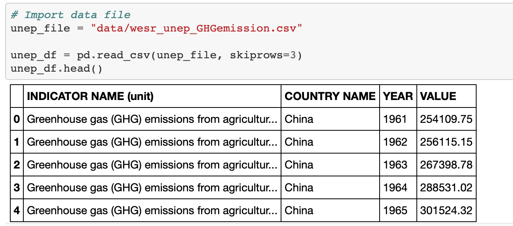

# ETL Project

Data and instructions provided by UC Berkeley Extension Data Analytics Bootcamp.

# Introduction 

The goal of this individual project is to use what I have learned so far from the bootcamp to Extract, Transform, and Load datasets.

# Technologies/Libraries

- Jupyter Notebook

- Python Pandas

- pyxlsb and open_workbook

- openpyxl

- requests

- json

- sqlalchemy and create_engine

- Conda Environment used: PythonData

- Postgres

# Files

- Data folder
    - where the dataset files are

- ETL_PROJECT.ipynb
    - Jupyter notebook where I performed ETL
    
- schema.sql
    - Where I updated the primary and foreign keys, as well as creating indexes, for the tables

- query.sql
    - Where I join the appropriate tables together

- ProjectReport
    - Word doc that contains my project report, which is contained here also

- Images
    - Code snippets and postgresql tables screenshots

# Project Report

For this project, my focus in on extracting and organizing data about renewable energy in China, Germany and the United States. To elaborate, the data are on electricity installed capacity (MW) for both non and renewable energy, total energy consumption, renewable energy type consumption, CO2 emission, and 2030 and 2050 agricultural GHG emission goals.

### Extract:
I extracted my dataset from four different sources: irena.org, bp.com, wesr.unep.org, and eia.gov. The dataset from irena.org was formatted as Excel (XLSB) file, the ones from bp.com were formatted as Excel (XLXS) file, the one from wesr.unep.org was formatted as CSV, and the one from eia.gov was in the form of JSON from API calling.

For easier read:
1.    irena.org, bp.com
    - Excel (XLSB) file
2.    bp.com
    - Excel (XLXS) file
3.    wesr.unep.org
    - CSV
4.    eia.gov
    - API

### Transform: 
I performed cleaning, filtering, joining, changing dataframe layout, aggregating and performing normalization for the datasets. I will list what I did for each dataset in details below:

1.    irena.org, bp.com

    - Cleaned the data to get the dataset display in the proper way for filtering, renaming, aggregating and performing normalization
    - Filtered out unneeded columns and rows, and then extracted data only from my three selected countries
    - Aggregated the three countries’ datasets together as one
    - Performed normalization of the dataset then renamed the columns

Before

After

2.    bp.com

    - Cleaned the data to get the dataset display in the proper way for filtering, renaming, aggregating and performing normalization
    - Filtered out unneeded columns and rows, and then extracted data only from my three selected countries
    - Changed the dataframe layout, so the year values are under the year column
    - Renamed the columns
    - Aggregated the three countries’ datasets together as one
    - Performed normalization of the dataset 

Before

After

3.    wesr.unep.org

    - Cleaned the data to get the dataset display in the proper way for filtering, renaming, aggregating and performing normalization
    - Filtered to get only my selected years 2030 and 2050
    - Aggregated the datatsets
    - Performed normalization of the dataset then renamed the columns
 
Before

After
 
 
4.    eia.gov

    - Renamed the columns and changed the order of the years from descending to ascending
    - Filtered out some years for the US one
    - Performed normalization of the dataset 

Before

After

### Load: 

I loaded the transformed dataframes to postgres in the form of tables. I chose to do that because the datasets are related to each other either by year or by country.

# References

I used class materials and outside resources as references. Asked intructor and TA for help during the transform part on one of the dataset.

#### Data Sources

- https://www.irena.org/Statistics/View-Data-by-Topic/Climate-Change/Avoided-Emissions-Calculator
- https://www.kaggle.com/unitednations/international-energy-statistics?select=all_energy_statistics.csv
    - which led me to data.un.org, which led me to bp.com
- https://www.bp.com/en/global/corporate/energy-economics/statistical-review-of-world-energy/downloads.html
- https://wesr.unep.org/downloader
- https://www.kaggle.com/mckenziejon/eia-electricity-generation-from-renewables
    - which led me to eia.gov
- https://www.eia.gov/opendata/
    - https://www.eia.gov/opendata/qb.php?category=2134384
    -  https://www.eia.gov/opendata/qb.php?category=2622652&sdid=INTL.4008-8-CHN-MMTCD.A

#### Outside references (as well as attempts)

- https://stackoverflow.com/questions/45019778/read-xlsb-file-in-pandas-python
- https://pypi.org/project/pyxlsb/
- https://stackoverflow.com/questions/46599016/reading-xlsx-file-using-jupyter-notebook
- http://www.python-excel.org
- https://openpyxl.readthedocs.io/en/stable/
- https://www.dataquest.io/blog/excel-and-pandas/
- https://www.geeksforgeeks.org/python-reading-excel-file-using-openpyxl-module/
- https://www.datacamp.com/community/tutorials/python-excel-tutorial
- https://pylightxl.readthedocs.io/en/latest/quickstart.html#read-excel-file
- https://stackoverflow.com/questions/65250207/pandas-cannot-open-an-excel-xlsx-file
- https://stackoverflow.com/questions/26147180/convert-row-to-column-header-for-pandas-dataframe
- https://datascience.stackexchange.com/questions/41448/how-to-rename-columns-that-have-the-same-name
- https://stackoverflow.com/questions/18039057/python-pandas-error-tokenizing-data
- https://www.geeksforgeeks.org/range-to-a-list-in-python/
- https://datacarpentry.org/python-ecology-lesson/05-merging-data/index.html
- https://datatofish.com/replace-values-pandas-dataframe/
- https://pandas.pydata.org/pandas-docs/stable/reference/api/pandas.DataFrame.to_sql.html
- https://www.postgresqltutorial.com/postgresql-change-column-type/
- https://www.techonthenet.com/postgresql/primary_keys.php
- https://www.tutorialspoint.com/postgresql/postgresql_data_types.htm
